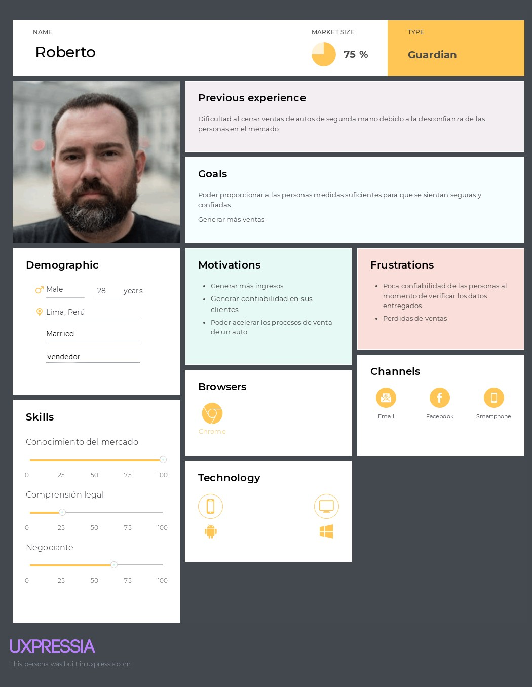

# 
COURSE PROJECT

    <strong>Universidad Peruana de Ciencias Aplicadas</strong> 
     
    <strong>Ingeniería de Software</strong> 
    <strong>Diseño de Experimentos - 4446</strong> 
    <strong>Profesor: Lennin Percy Cenas Vasquez </strong> 
     INFORME

#### Startup: **DevTest**

#### Product: **WeCar**

#### Año: **2025**

# Team  Members:

|             Member                        |      Code      |
|-------------------------------------------|:--------------:|
| Rodrigo Alejandro Aguilar Castillo        |   u202210584   |
| Jean Franco Joel Barrionuevo Reto         |   u202219284   |
| Mathias Tsuneo Kunimoto Watanabe          |   u202210148   |
| Italo D'alessandro Luna Capuñay           |   u202213375   |
| Augusto Jose Pin Matallana                |   u202210257   |

# Registro de Versiones del Informe

| Version |   Fecha    | Autor  | Descripcion de Modificacion |
|---------|------------|--------|-----------------------------|
| 0.0     | 24/05/2025 | Nombre |      Crea documento         |

# Project Report Collaboration Insights

Repositorios:

Proyecto: (...)

Landing Page: (...)

Web Page del Proyecto: (...)

Mobile App del Proyecto (...)

Back End del Proyecto: (...)

### TB1

Para la entrega del TB1 se han hecho ...

Se muestran evidencias de los commits realizados en la entrega de la TB1 en el informe

  

[Colaboraciones del repositorio]

  
[Registro de los commits donde se realizaron la mayor cantidad]

En ambos casos se puede observar el incremento de modificaciones y revisiones en la primera semana de abril.

---

# Contenido

[Student Outcome](#student-outcome)

[Capítulo I: Introducción](#capítulo-i-introducción)  
[1.1. Startup Profile](#11-startup-profile)  
[1.1.1. Descripción de la Startup](#111-descripción-de-la-startup)  
[1.1.2. Perfiles de integrantes del equipo](#112-perfiles-de-integrantes-del-equipo)  
[1.2. Solution Profile](#12-solution-profile)  
[1.2.1. Antecedentes y problemática](#121-antecedentes-y-problemática)  
[1.2.2. Lean UX Process](#122-lean-ux-process)  
[1.2.2.1. Lean UX Problem Statements](#1221-lean-ux-problem-statements)  
[1.2.2.2. Lean UX Assumptions](#1222-lean-ux-assumptions)  
[1.2.2.3. Lean UX Hypothesis Statements](#1223-lean-ux-hypothesis-statements)  
[1.2.2.4. Lean UX Canvas](#1224-lean-ux-canvas)  
[1.3. Segmentos objetivo](#13-segmentos-objetivo)  

[Capítulo II: Requirements Elicitation & Analysis](#capítulo-ii-requirements-elicitation-analysis)  
[2.1. Competidores](#21-competidores)  
[2.1.1. Análisis competitivo](#211-análisis-competitivo)  
[2.1.2. Estrategias y tácticas frente a competidores](#212-estrategias-y-tácticas-frente-a-competidores)  
[2.2. Entrevistas](#22-entrevistas)  
[2.2.1. Diseño de entrevistas](#221-diseño-de-entrevistas)  
[2.2.2. Registro de entrevistas](#222-registro-de-entrevistas)  
[2.2.3. Análisis de entrevistas](#223-análisis-de-entrevistas)  
[2.3. Needfinding](#23-needfinding)  
[2.3.1. User Personas](#231-user-personas)  
[2.3.2. User Task Matrix](#232-user-task-matrix)  
[2.3.3. User Journey Mapping](#233-user-journey-mapping)  
[2.3.4. Empathy Mapping](#234-empathy-mapping)  
[2.3.5. As-is Scenario Mapping](#235-as-is-scenario-mapping)  
[2.4. Ubiquitous Language](#24-ubiquitous-language)  

[Capítulo III: Requirements Specification](#capítulo-iii-requirements-specification)  
[3.1. To-Be Scenario Mapping](#31-to-be-scenario-mapping)  
[3.2. User Stories](#32-user-stories)  
[3.3. Product Backlog](#33-product-backlog)  
[3.4. Impact Mapping](#34-impact-mapping)  

[Capítulo IV: Product Design](#capítulo-iv-product-design)  
[4.1. Style Guidelines](#41-style-guidelines)  
[4.1.1. General Style Guidelines](#411-general-style-guidelines)  
[4.1.2. Web Style Guidelines](#412-web-style-guidelines)  
[4.1.3. Mobile Style Guidelines](#413-mobile-style-guidelines)  
[4.1.3.1. iOS Mobile Style Guidelines](#4131-ios-mobile-style-guidelines)  
[4.1.3.2. Android Mobile Style Guidelines](#4132-android-mobile-style-guidelines)  
[4.2. Information Architecture](#42-information-architecture)  
[4.2.1. Organization Systems](#421-organization-systems)  
[4.2.2. Labeling Systems](#422-labeling-systems)  
[4.2.3. SEO Tags and Meta Tags](#423-seo-tags-and-meta-tags)  
[4.2.4. Searching Systems](#424-searching-systems)  
[4.2.5. Navigation Systems](#425-navigation-systems)  
[4.3. Landing Page UI Design](#43-landing-page-ui-design)  
[4.3.1. Landing Page Wireframe](#431-landing-page-wireframe)  
[4.3.2. Landing Page Mock-up](#432-landing-page-mock-up)  
[4.4. Mobile Applications UX/UI Design](#44-mobile-applications-ux-ui-design)  
[4.4.1. Mobile Applications Wireframes](#441-mobile-applications-wireframes)  
[4.4.2. Mobile Applications Wireflow Diagrams](#442-mobile-applications-wireflow-diagrams)  
[4.4.3. Mobile Applications Mock-ups](#443-mobile-applications-mock-ups)  
[4.4.4. Mobile Applications User Flow Diagrams](#444-mobile-applications-user-flow-diagrams)  
[4.5. Mobile Applications Prototyping](#45-mobile-applications-prototyping)  
[4.5.1. Android Mobile Applications Prototyping](#451-android-mobile-applications-prototyping)  
[4.5.2. iOS Mobile Applications Prototyping](#452-ios-mobile-applications-prototyping)  
[4.6. Web Applications UX/UI Design](#46-web-applications-ux-ui-design)  
[4.6.1. Web Applications Wireframes](#461-web-applications-wireframes)  
[4.6.2. Web Applications Wireflow Diagrams](#462-web-applications-wireflow-diagrams)  
[4.6.3. Web Applications Mock-ups](#463-web-applications-mock-ups)  
[4.6.4. Web Applications User Flow Diagrams](#464-web-applications-user-flow-diagrams)  
[4.7. Web Applications Prototyping](#47-web-applications-prototyping)  
[4.8. Domain-Driven Software Architecture](#48-domain-driven-software-architecture)  
[4.8.1. Software Architecture Context Diagram](#481-software-architecture-context-diagram)  
[4.8.2. Software Architecture Container Diagrams](#482-software-architecture-container-diagrams)  
[4.8.3. Software Architecture Components Diagrams](#483-software-architecture-components-diagrams)  
[4.9. Software Object-Oriented Design](#49-software-object-oriented-design)  
[4.9.1. Class Diagrams](#491-class-diagrams)  
[4.9.2. Class Dictionary](#492-class-dictionary)  
[4.10. Database Design](#410-database-design)  
[4.10.1. Relational/Non-Relational Database Diagram](#4101-relationalnon-relational-database-diagram)  

[Capítulo V: Product Implementation](#capítulo-v-product-implementation)  
[5.1. Software Configuration Management](#51-software-configuration-management)  
[5.1.1. Software Development Environment Configuration](#511-software-development-environment-configuration)  
[5.1.2. Source Code Management](#512-source-code-management)  
[5.1.3. Source Code Style Guide & Conventions](#513-source-code-style-guide-conventions)  
[5.1.4. Software Deployment Configuration](#514-software-deployment-configuration)  
[5.2. Product Implementation & Deployment](#52-product-implementation-deployment)  
[5.2.1. Sprint Backlogs](#521-sprint-backlogs)  
[5.2.2. Implemented Landing Page Evidence](#522-implemented-landing-page-evidence)  
[5.2.3. Implemented Frontend-Web Application Evidence](#523-implemented-frontend-web-application-evidence)  
[5.2.4. Implemented Native-Mobile Application Evidence](#524-implemented-native-mobile-application-evidence)  
[5.2.5. Implemented RESTful API and/or Serverless Backend Evidence](#525-implemented-restful-api-andor-serverless-backend-evidence)  
[5.2.6. RESTful API documentation](#526-restful-api-documentation)  
[5.2.7. Team Collaboration Insights](#527-team-collaboration-insights)  
[5.3. Video About-the-Product](#53-video-about-the-product)  

[Capítulo VI: Product Verification & Validation](#capítulo-vi-product-verification-validation)  
[6.1. Testing Suites & Validation](#61-testing-suites-validation)  
[6.1.1. Core Entities Unit Tests](#611-core-entities-unit-tests)  
[6.1.2. Core Integration Tests](#612-core-integration-tests)  
[6.1.3. Core Behavior-Driven Development](#613-core-behavior-driven-development)  
[6.1.4. Core System Tests](#614-core-system-tests)  
[6.2. Static testing & Verification](#62-static-testing-verification)  
[6.2.1. Static Code Analysis](#621-static-code-analysis)  
[6.2.1.1. Coding standard & Code conventions](#6211-coding-standard-code-conventions)  
[6.2.1.2. Code Quality & Code Security](#6212-code-quality-code-security)  
[6.2.2. Reviews](#622-reviews)  
[6.3. Validation Interviews](#63-validation-interviews)  
[6.3.1. Diseño de Entrevistas](#631-diseño-de-entrevistas)  
[6.3.2. Registro de Entrevistas](#632-registro-de-entrevistas)  
[6.3.3. Evaluaciones según heurísticas](#633-evaluaciones-según-heurísticas)  
[6.4. Auditoría de Experiencias de Usuario](#64-auditoría-de-experiencias-de-usuario)  
[6.4.1. Auditoría realizada](#641-auditoría-realizada)  
[6.4.1.1. Información del grupo auditado](#6411-información-del-grupo-auditado)  
[6.4.1.2. Cronograma de auditoría realizada](#6412-cronograma-de-auditoría-realizada)  
[6.4.1.3. Contenido de auditoría realizada](#6413-contenido-de-auditoría-realizada)  
[6.4.2. Auditoría recibida](#642-auditoría-recibida)  
[6.4.2.1. Información del grupo auditor](#6421-información-del-grupo-auditor)  
[6.4.2.2. Cronograma de auditoría recibida](#6422-cronograma-de-auditoría-recibida)  
[6.4.2.3. Contenido de auditoría recibida](#6423-contenido-de-auditoría-recibida)  
[6.4.2.4. Resumen de modificaciones para subsanar hallazgos](#6424-resumen-de-modificaciones-para-subsanar-hallazgos)  

[Capítulo VII: DevOps Practices](#capítulo-vii-devops-practices)  
[7.1. Continuous Integration](#71-continuous-integration)  
[7.1.1. Tools and Practices](#711-tools-and-practices)  
[7.1.2. Build & Test Suite Pipeline Components](#712-build-test-suite-pipeline-components)  
[7.2. Continuous Delivery](#72-continuous-delivery)  
[7.2.1. Tools and Practices](#721-tools-and-practices)  
[7.2.2. Stages Deployment Pipeline Components](#722-stages-deployment-pipeline-components)  
[7.3. Continuous deployment](#73-continuous-deployment)  
[7.3.1. Tools and Practices](#731-tools-and-practices)  
[7.3.2. Production Deployment Pipeline Components](#732-production-deployment-pipeline-components)  
[7.4. Continuous Monitoring](#74-continuous-monitoring)  
[7.4.1. Tools and Practices](#741-tools-and-practices)  
[7.4.2. Monitoring Pipeline Components](#742-monitoring-pipeline-components)  
[7.4.3. Alerting Pipeline Components](#743-alerting-pipeline-components)  
[7.4.4. Notification Pipeline Components](#744-notification-pipeline-components)  

[Capítulo VIII: Experiment-Driven Development](#capítulo-viii-experiment-driven-development)  
[8.1. Experiment Planning](#81-experiment-planning)  
[8.1.1. As-Is Summary](#811-as-is-summary)  
[8.1.2. Raw Material: Assumptions, Knowledge Gaps, Ideas, Claims](#812-raw-material-assumptions-knowledge-gaps-ideas-claims)  
[8.1.3. Experiment-Ready Questions](#813-experiment-ready-questions)  
[8.1.4. Question Backlog](#814-question-backlog)  
[8.1.5. Experiment Cards](#815-experiment-cards)  
[8.2. Experiment Design](#82-experiment-design)  
[8.2.1. Hypotheses](#821-hypotheses)  
[8.2.2. Measures](#822-measures)  
[8.2.3. Conditions](#823-conditions)  
[8.2.4. Scale Calculations and Decisions](#824-scale-calculations-and-decisions)  
[8.2.5. Methods Selection](#825-methods-selection)  
[8.2.6. Data Analytics: Goals, KPIs and Metrics Selection](#826-data-analytics-goals-kpis-and-metrics-selection)  
[8.2.7. Web and Mobile Tracking Plan](#827-web-and-mobile-tracking-plan)  
[8.3. Experimentation](#83-experimentation)  
[8.3.1. To-Be User Stories](#831-to-be-user-stories)  
[8.3.2. To-Be Product Backlog](#832-to-be-product-backlog)  
[8.3.3. Pipeline-supported, Experiment-Driven To-Be Software Platform Lifecycle](#833-pipeline-supported-experiment-driven-to-be-software-platform-lifecycle)  
[8.3.3.1. To-Be Sprint Backlogs](#8331-to-be-sprint-backlogs)  
[8.3.3.2. Implemented To-Be Landing Page Evidence](#8332-implemented-to-be-landing-page-evidence)  
[8.3.3.3. Implemented To-Be Frontend-Web Application Evidence](#8333-implemented-to-be-frontend-web-application-evidence)  
[8.3.3.4. Implemented To-Be Native-Mobile Application Evidence](#8334-implemented-to-be-native-mobile-application-evidence)  
[8.3.3.5. Implemented To-Be RESTful API and/or Serverless Backend Evidence](#8335-implemented-to-be-restful-api-andor-serverless-backend-evidence)  
[8.3.3.6. Team Collaboration Insights](#8336-team-collaboration-insights)  
[8.3.4. To-Be Validation Interviews](#834-to-be-validation-interviews)  
[8.3.4.1. Diseño de Entrevistas](#8341-diseño-de-entrevistas)  
[8.3.4.2. Registro de Entrevistas](#8342-registro-de-entrevistas)  
[8.4. Experiment Aftermath & Analysis](#84-experiment-aftermath-analysis)  
[8.4.1. Analysis and Interpretation of Results](#841-analysis-and-interpretation-of-results)  
[8.4.2. Re-scored and Re-prioritized Question Backlog](#842-re-scored-and-re-prioritized-question-backlog)  
[8.5. Continuous Learning](#85-continuous-learning)  
[8.5.1. Shareback Session Artifacts: Learning Workflow](#851-shareback-session-artifacts-learning-workflow)  
[8.6. To-Be Software Platform Pre-launch](#86-to-be-software-platform-pre-launch)  
[8.6.1. About-the-Product Intro Video](#861-about-the-product-intro-video)  

## Conclusiones

[Conclusiones y recomendaciones](#conclusiones-y-recomendaciones)  

[Video About-the-Team](#video-about-the-team)

[Bibliografía](#bibliografía)

[Anexos](#anexos)

# Student Outcome

| Criterio Especifico| Acciones Realizadas| Conclusiones|
|--------------------|--------------------|-------------|
| **///** |...|...|
|**///**|...|...| 

# Capítulo I: Introducción

## 1.1. Startup Profile

### 1.1.1. Descripción de la Startup

DevTest es una startup fundada en 2024 por un grupo de estudiantes de Ingeniería de Software. Nuestra plataforma busca revolucionar el mercado de autos usados, brindando una alternativa innovadora y accesible para quienes desean comprar o vender vehículos de segunda mano.

Misión: Facilitar el proceso de compra y venta de autos usados a través de una plataforma ágil e intuitiva, ofreciendo a nuestros usuarios todas las herramientas necesarias para garantizar una experiencia sencilla, segura y confiable.

Visión: Ser la plataforma líder a nivel nacional en el comercio de vehículos usados, promoviendo la confianza y satisfacción en cada operación realizada por nuestros usuarios.

#### 1.1.2. Perfiles de integrantes del equipo

|                                                                                                                                | Miembros del equipo | Código Estudiante | Carrera                | Conocimientos / Habilidades                                                                                                                                                                                                                                        |
|--------------------------------------------------------------------------------------------------------------------------------|--------------------|-------------------|------------------------|--------------------------------------------------------------------------------------------------------------------------------------------------------------------------------------------------------------------------------------------------------------------|
|       | Mathias Kunimoto | u202210148        | Ingeniería de software | Tengo experiencia en el desarrollo frontend, trabajando con tecnologías como Tailwind CSS, React y JavaScript. Me considero una persona sociable, organizada y con gran capacidad de adaptación, lo que me permite integrarme fácilmente en equipos de trabajo y aportar al cumplimiento de los objetivos. Siempre busco sacar mi mayor potencial, aprendiendo constantemente y contribuyendo con una actitud proactiva y comprometida. |
|                | Augusto Pin | u202210257        | Ingeniería de software | Me considero una persona responsable y determinada a cumplir metas, dispuesto a aprender y a practicar en el mundo de la programacion, tengo experiencia desarrollando frontend, usando tailwind y como principal framework VueJs, siempre busco aprender y desarrollarme más como programador para ser mejor. |
|         | Rodrigo Aguilar | u202210584        | Ingeniería de software |  Me apasiona la tecnología y los dispositivos electrónicos, y disfruto especialmente programar, lo cual se ha convertido en uno de mis principales pasatiempos. Siempre estoy buscando aprender nuevas herramientas y mejorar mis habilidades en el desarrollo de software. |
|  | Franco Barrionuevo | u202219284        | Ingeniería de software | Soy una persona responsable y comprometida con mis tareas. Me gusta aprender cosas nuevas y siempre busco mejorar mis habilidades. Tengo experiencia en el desarrollo frontend, utilizando tecnologías como React y Tailwind CSS. |

## 1.2. Solution Profile

En esta sección se detallan los aspectos claves de nuestra solución de software, incluyendo sus
características distintivas, propuestas de valor y estrategias de monetización.

**Nombre del producto:** WeCar

**Descripción:** WeCar es una plataforma innovadora diseñada para facilitar la compra y
venta de autos de segunda mano, conectando de manera eficiente a compradores y vendedores.
La plataforma ofrece una experiencia fluida y sin problemas, permitiendo a los usuarios explorar vehículos,
gestionar sus publicaciones y comunicarse de manera efectiva. WeCar proporciona herramientas de seguimiento
en tiempo real para las transacciones y opciones de personalización que garantizan una experiencia óptima y segura.

**Monetización:** WeCar generará ingresos mediante una combinación de planes de suscripción y
comisiones por venta. Los vendedores podrán elegir entre diferentes planes de suscripción,
que ofrecen acceso a funciones avanzadas como la destacación de anuncios, herramientas de marketing
y análisis detallados. Además, se aplicará una comisión básica por cada transacción completada.
Los compradores realizarán el pago a través de transferencia bancaria, subiendo una captura de pantalla
del comprobante para que el vendedor confirme la transacción. Esta estrategia mixta asegura que tanto los usuarios que opten por un plan de
suscripción como aquellos que prefieran pagar por transacción puedan beneficiarse de la plataforma.

### 1.2.1 Antecedentes y problemática

Para la elaboración de la descripción de la problemática y antecedentes de la solución, se ha utilizado el método de las 5 'W's y 2 'H's.

La industria de compra y venta de autos de segunda mano enfrenta desafíos significativos
en términos de seguridad, eficiencia y accesibilidad. Los compradores y vendedores se encuentran
bajo presión debido a la creciente demanda de vehículos usados, pero enfrentan obstáculos como la falta
de plataformas seguras, la dificultad para verificar la autenticidad de los pagos,
y la escasez de herramientas tecnológicas que faciliten transacciones confiables y sin fricciones.

-   **What?**   
    La industria automotriz de segunda mano enfrenta desafíos importantes en la
    gestión eficiente de las transacciones y la seguridad de las mismas,
    debido a la falta de plataformas tecnológicas adecuadas que garanticen procesos transparentes y seguros.
      
- **When?**                      
  Este problema se ha intensificado en los últimos años, especialmente con el crecimiento del mercado de autos usados,
  impulsado por el aumento de la demanda y la necesidad de opciones más accesibles para los consumidores.
    
-   **Where?**                         
    Este problema es global y afecta a compradores y vendedores en diversas regiones del mundo, tanto en mercados desarrollados como en desarrollo.
      
-   **Who?**           
    Los compradores y vendedores de autos usados, desde individuos hasta concesionarios pequeños, están directamente involucrados en estas dificultades,
    ya que son responsables de realizar transacciones seguras y exitosas en un mercado competitivo.
      
- **Why?**             
  Es crucial abordar esta problemática porque la compra y venta de autos de segunda mano es una parte esencial de la economía global, ofreciendo opciones
  asequibles para los consumidores y contribuyendo al desarrollo económico de muchos países.
    
-   **How?**                    
    Se necesitan soluciones tecnológicas innovadoras que ayuden a los usuarios a realizar transacciones de manera más segura, eficiente y confiable, optimizando
    la experiencia de compra y venta y garantizando la transparencia en cada paso del proceso.
      
-   **How much?**                         
    El costo de implementar estas soluciones tecnológicas puede variar según la escala de la plataforma y los
    recursos disponibles para la adopción de tecnología en el mercado de autos de segunda mano.
      

### 1.2.2 Lean UX Process.

#### 1.2.2.1. Lean UX Problem Statements
- En la industria de compra y venta de autos de segunda mano, existe
  una falta de plataformas tecnológicas integradas que permitan a los compradores y vendedores realizar
  transacciones de manera segura y eficiente. Este vacío tecnológico dificulta la confianza entre las partes y
  la optimización del proceso de compra-venta, lo que conduce a una experiencia frustrante y puede limitar el crecimiento de este mercado.
  Además, mejorar la colaboración entre compradores, vendedores y talleres técnicos es crucial para garantizar transacciones transparentes y
  satisfactorias para todas las partes involucradas.

#### 1.2.2.2. Lean UX Assumptions

#### 1.2.2.2. Lean UX Assumptions

### Business Outcomes

- Lograr un crecimiento mensual del **20%** en el número de usuarios activos de la plataforma, medido por el número de transacciones realizadas a través de WeCar.
- Tener al menos **200 vehículos vendidos** a través de la plataforma en el primer año de lanzamiento.
- Alcanzar una **tasa de satisfacción del 85%** entre los usuarios al final del primer año, lo que indicará una alta retención y confianza en la plataforma.

---

### User Assumptions

#### 1. ¿Quién es el usuario?
- Compradores de autos usados  
- Vendedores de autos usados  
- Talleres técnicos

#### 2. ¿Dónde entra nuestro producto en su trabajo o su vida?
WeCarGo se integra directamente en la vida de los compradores y vendedores al facilitar el proceso de transacción, haciéndolo más seguro y accesible.

#### 3. ¿Cuál es el problema que nuestro producto soluciona?
- Falta de transparencia y confianza en las transacciones de autos usados.  
- Dificultades en la verificación del estado del vehículo y la confirmación de pagos.  
- Complejidad en la comunicación entre compradores, vendedores y talleres técnicos.

#### 4. ¿Cómo y cuándo nuestro producto es usado?
La plataforma será utilizada durante todo el proceso de compra y venta, desde la búsqueda del vehículo hasta la confirmación del pago. Los talleres técnicos usarán aquella información para ofrecer sus servicios.

#### 5. ¿Qué características son importantes?
- Sistema de filtrado y verificación de vehículos  
- Transacciones seguras mediante verificación de pago  
- Organización y seguimiento del proceso de compra-venta  
- Información detallada y transparente sobre los vehículos  
- Comunicación eficiente entre compradores y vendedores

#### 6. ¿Cómo debería nuestro producto verse o comportarse?
El producto debe verse con una interfaz **simple, interactiva, atractiva e inclusiva**. Debe comportarse de forma fluida, captar la atención del usuario y ofrecer una experiencia innovadora y acogedora.

---

###  User Outcomes

#### Compradores de Autos Usados
Aumentar la confianza en el proceso de compra de vehículos usados, logrando una **reducción del 30% en el número de incidencias críticas** reportadas durante el primer año de uso de WeCar.

#### Vendedores de Autos Usados
Mejorar la **tasa de conversión de ventas en un 25%** durante el primer año, asegurando que solo vehículos verificados y aprobados sean listados.

#### Talleres Técnicos
Incrementar en un **40% el número de inspecciones y certificaciones** realizadas en el primer año, integrando eficientemente sus servicios en la plataforma.

---

### ¿Qué está intentando conseguir el usuario?

- **Compradores:** Quiero encontrar un auto confiable y realizar la compra de manera segura.  
- **Vendedores:** Quiero vender mis autos de manera rápida y segura.  
- **Talleres Técnicos:** Quiero ofrecer mis servicios de inspección y certificación de vehículos de manera eficiente y confiable.

---

### ¿Cómo se quiere sentir el usuario?

- **Compradores de autos usados:** Quiero sentir confianza y seguridad al momento de realizar mi compra.  
- **Vendedores de autos usados:** Quiero sentirme respaldado y protegido durante el proceso de venta.  
- **Talleres Técnicos:** Quiero sentirme valorado y reconocido por mi trabajo en la plataforma.

---

### ¿Cómo nuestro producto lo acerca a su objetivo?

- **Compradores de autos usados:** Les proporciona una plataforma segura para encontrar y comprar vehículos usados.  
- **Vendedores de autos usados:** Les facilita el proceso de venta, asegurando la transacción y reduciendo riesgos.  
- **Talleres Técnicos:** Les conecta con clientes potenciales, incrementando la demanda de sus servicios.

---

### ¿Por qué nuestros usuarios se interesaron por nuestro producto? ¿Qué beneficio podrían obtener?

- **Compradores:** Acceso a una plataforma segura y confiable para comprar autos usados.  
- **Vendedores:** Capacidad de vender sus vehículos de manera rápida y sin riesgos.  
- **Talleres Técnicos:** Oportunidad de ofrecer servicios a un mercado específico y creciente.

---

### ¿Qué cambio en su comportamiento veremos que nos dirá que nuestro objetivo ha sido logrado?

#### Compradores y Vendedores
Uso constante de la plataforma para las transacciones de autos usados. Un incremento en el número de transacciones y una reducción de quejas relacionadas con transparencia y verificación indicarán éxito.

#### Talleres Técnicos
Aumento en la demanda de servicios ofrecidos por la plataforma. Más inspecciones y certificaciones realizadas indicarán una colaboración exitosa y beneficiosa con WeCar.

---

### Feature Assumptions

- Creemos que el producto debe contar con **planes estándar y premium** adaptados a las necesidades del usuario, ofreciendo flexibilidad y valor agregado.
- Creemos que el producto debe **proporcionar opciones de valoración y revisión** de autos por parte de talleres técnicos.
- Creemos que el producto debe ofrecer un **sistema de verificación de pagos y transacciones seguras**.
- Creemos que el producto debe facilitar la **comunicación directa entre compradores y vendedores** para mejorar la transparencia y la confianza.

#### 1.2.2.3. Lean UX Hypothesis Statements.

#### 1.2.2.4. Lean UX Canvas.

Finalmente juntamos todo lo que hemos hecho en este proceso y lo agregamos en un Lean UX Canvas (V2) guiandonos del ejemplo que nos proporciona Jeff Gothelf [Anexo 1.1]

<image src ="../assets/lean-ux-canvas/lean-ux-canva.png" alt ="LeanUX Canvas (V2) [implementando lean UX 3]">

## 2.1. Competidores

Nuestros competidores abarcan una variedad de empresas en el mercado de autos de segunda mano, que se han ido fortaleciendo a lo largo del tiempo en plataformas digitales. Esto abarca grandes sitios webs de venta de vehículos usados.

Aquí unos competidores directos que proporcionan servicios similares al nuestro:

- **NeoAuto**: [NeoAuto](https://neoauto.com/venta-de-autos-usados-en-lima?gad_source=1&gclid=Cj0KCQjw_sq2BhCUARIsAIVqmQtS4NTpmRTLgjG9aqoxczpnBP_zQPfrGnqWX53OOE22ruL_N90cup8aAvHuEALw_wcB)

  NeoAuto es una plataforma en línea disponible para web y dispositivos móviles que facilita la compra y venta de autos de segunda mano. Fundada por un equipo de innovadores peruanos, NeoAuto ha logrado posicionarse como uno de los líderes en el mercado automotriz de segunda mano en Perú. La plataforma permite a los usuarios acceder a una amplia variedad de vehículos usados, todos verificados para garantizar su calidad y confiabilidad. Gracias a su gran aceptación, NeoAuto se ha expandido y ahora es un referente en el sector automotriz en el país, ayudando a miles de peruanos a encontrar su auto ideal.

  
- **AUTOLAND Perú**: [AutoLand Perú](https://autoland.com.pe/seminuevos/)

  AutoLand Perú es un portal en línea especializado en la compra y venta de vehículos de segunda mano, accesible tanto desde su sitio web como desde su aplicación móvil. Fundado por un grupo de expertos en el sector automotriz peruano, AutoLand Perú se ha destacado por ofrecer una plataforma confiable y segura para transacciones de autos usados. La plataforma permite a los usuarios explorar una extensa selección de vehículos, todos sometidos a rigurosas inspecciones para asegurar su calidad. Gracias a su enfoque en la satisfacción del cliente, AutoLand Perú se ha consolidado como una de las opciones preferidas en el mercado de autos de segunda mano en el país.

  
- **Autopia.pe**: [Autopia.pe](https://www.autopia.pe)

  Autopia.pe es una plataforma digital especializada en la compra y venta de autos de segunda mano, diseñada para brindar a los usuarios una experiencia simple y segura. Fundada por un equipo de emprendedores peruanos apasionados por el sector automotriz, Autopia.pe se ha posicionado rápidamente como una opción confiable para quienes buscan vehículos usados en Perú. La plataforma ofrece una amplia gama de autos, todos inspeccionados y certificados para garantizar su estado y calidad. Gracias a su enfoque en la transparencia y la satisfacción del cliente, Autopia.pe se ha convertido en una referencia clave en el mercado automotriz de segunda mano en el país.

  

## 2.1.1. Análisis competitivo
<table>
 <tr>
    <th colspan="6">Competitive Analysis Landscape</th>
  </tr>
  <tr>
  <th>¿Por qué llevar a cabo este análisis?</th>
    <td colspan="6"> Realizaremos un análisis competitivo porque es muy importante identificar oportunidades de diferenciación, entender las fortalezas y debilidades de los competidores, y adaptar la estrategia para posicionar mejor la plataforma en el mercado.</td>
  </tr>
  <tr>
    <th></th>
    <th></th>
    <th>WeCar</th>
    <th>NeoAuto</th>
    <th>AutoLand Perú</th>
    <th>Autopia.pe</th>
  </tr>
  <tr>
    <th rowspan="2">Perfil</th>
    <td><strong>Overview</strong></td>
    <td>Plataforma de compra y venta de autos de segunda mano con un fuerte énfasis en la verificación y certificación de datos.</td>
    <td>Plataforma en línea para la compra y venta de autos de segunda mano en Perú, con una sólida presencia en el mercado.</td>
    <td>Plataforma especializada en la compra y venta de vehículos usados, con un énfasis en la confiabilidad y seguridad de las transacciones.</td>
    <td>Plataforma digital enfocada en la simplicidad y seguridad de la compra y venta de autos de segunda mano.</td>
  </tr>
  <tr>
    <td><strong>Ventaja competitiva ¿Qué valor ofrece a los clientes?</strong></td>
    <td>Seguridad y confianza al comprar, sabiendo que todos los datos y fotos están verificados y actualizados regularmente. Ahorran tiempo al evitar pasos adicionales de verificación.</td>
    <td>Acceso a una gran cantidad de opciones y confianza en una plataforma bien establecida.</td>
    <td>Tranquilidad al saber que los autos han pasado por un proceso de inspección.</td>
    <td>Proceso de compra sencillo y seguro, con una selección de vehículos que han sido inspeccionados.</td>
  </tr>
  <tr>
    <th rowspan="2">Perfil de Marketing</th>
    <td><strong>Mercado objetivo</strong></td>
    <td>Compradores y vendedores de autos de segunda mano que buscan seguridad y confianza en su adquisición.</td>
    <td>Consumidores peruanos interesados en comprar o vender autos usados a través de una plataforma confiable.</td>
    <td>Consumidores peruanos que priorizan la seguridad y confiabilidad en la compra de un auto de segunda mano.</td>
    <td>Usuarios que buscan una plataforma fácil de usar para comprar o vender autos usados, con énfasis en la transparencia y satisfacción del cliente.</td>
  </tr>
  <tr>
    <td><strong>Estrategias de marketing</strong></td>
    <td>Campañas focalizadas en redes sociales y Google ads, orientadas a personas que buscan comprar un auto usado.</td>
    <td>Campañas de branding en televisión, radio y redes sociales para mantener la visibilidad de la marca a nivel nacional.</td>
    <td>Anuncios en prensa, radio y televisión local que resalten la confiabilidad y las rigurosas inspecciones de los autos en venta.</td>
    <td>Campañas en redes sociales enfocadas a un público más joven, destacando la facilidad de uso y la transparencia de la plataforma.</td>
  </tr>
  <tr>
    <th rowspan="3">Perfil de Producto</th>
    <td><strong>Productos & Servicios</strong></td>
    <td>Autos verificados y certificados mensualmente, con asesoría personalizada.</td>
    <td>Amplio catálogo de autos usados, con servicios adicionales como financiamiento y seguros.</td>
    <td>Autos usados con inspecciones rigurosas y garantía limitada.</td>
    <td>Autos seleccionados con inspección única al momento de la publicación, enfocados en la transparencia.</td>
  </tr>
  <tr>
    <td><strong>Precios & Costos</strong></td>
    <td>Precios medio-altos debido a las certificaciones mensuales; costos operativos elevados por las inspecciones regulares.</td>
    <td>Variedad de precios, desde opciones económicas hasta de alta gama; costos moderados por verificación básica.</td>
    <td>Precios competitivos con un enfoque en el valor a través de la calidad; costos relacionados con inspecciones detalladas.</td>
    <td>Precios variados con enfoque en la transparencia; costos de mantenimiento digital y una única certificación inicial.</td>
  </tr>
  <tr>
    <td><strong>Canales de distribución (Web y/o Móvil)</strong></td>
    <td>Distribución digital a través de web y app, con apoyo de talleres asociados.</td>
    <td>Distribución principal en su sitio web y aplicación móvil, con apoyo de socios financieros.</td>
    <td>Distribución en línea y en puntos de venta físicos.</td>
    <td>Distribución digital a través de su sitio web y app, con atención al cliente en línea.</td>
  </tr>
  <tr>
    <th rowspan="4">Análisis SWOT</th>
    <td><strong>Fortalezas</strong></td>
    <td>Verificación y certificación mensual de vehículo, lo que garantiza alta confianza y seguridad para el comprador.</td>
    <td>Amplia oferta de vehículos y sólida presencia en el mercado, con servicios adicionales como financiamiento.</td>
    <td>Inspecciones rigurosas y garantía limitada que refuerzan la calidad y seguridad de los autos vendidos.</td>
    <td>Transparencia en la información del vehículo y proceso de compra simplificado.</td>
  </tr>
  <tr>
    <td><strong>Debilidades</strong></td>
    <td>Costos operativos altos debido a las inspecciones mensuales, lo que puede traducirse en precios más altos para los usuarios.</td>
    <td>Menor enfoque en la verificación continua de datos, lo que puede generar dudas sobre la autenticidad de la información.</td>
    <td>Dependencia de puntos de venta físicos puede limitar el alcance y la comodidad en comparación con plataformas digitales puras.</td>
    <td>Inspección única puede no ofrecer el mismo nivel de garantía continua que la verificación mensual de Wecar.</td>
  </tr>
  <tr>
    <td><strong>Oportunidades</strong></td>
    <td>Expansión de otros mercados que valoren la verificación continua y el valor añadido de vehículos certificados.</td>
    <td>Expansión de servicios adicionales como seguros y financiamiento para atraer a más compradores.</td>
    <td>Potencial para integrar más tecnología y herramientas digitales para mejorar la experiencia del usuario.</td>
    <td>Ampliar la oferta de servicios adicionales y mejorar la frecuencia de inspección para competir con plataformas que ofrezcan verificación continua.</td>
  </tr>
  <tr>
    <td><strong>Amenazas</strong></td>
    <td>Competencia de plataformas con menores costos operativos y precios más bajos que no ofrecen verificación continua.</td>
    <td>Riesgo de pérdida de credibilidad si no se mejora la verificación de datos frente a competidores más transparentes.</td>
    <td>Competencia creciente de plataformas digitales que ofrecen una experiencia más ágil y moderna.</td>
    <td>Riesgo de quedar atrás si no se actualizan las prácticas de verificación y certificación para igualar a competidores con procesos más exhaustivos.</td>
  </tr>
</table>

### 2.1.2 Estrategias y tácticas frente a competidores

WeCar se posiciona como una plataforma eficiente que conecta compradores y vendedores de autos de manera segura. Para destacarnos de la competencia, implementamos estas estrategias:

<strong>Interfaz Sencilla:</strong> La aplicación es fácil de usar, permitiendo a los usuarios publicar y buscar autos rápidamente, incluso sin experiencia tecnológica.

<strong>Comunicación efectiva:</strong> Proporcionamos el contacto para el contacto directo con el vendedor y asi ponerse de acuerdo con la venta y el producto, tambien se pueden resolver las posibles dudas.

<strong>Autenticación Segura:</strong> Implementamos un sistema de autenticación de verificación de identidad mediante documentos. Esto garantiza que tanto compradores como vendedores estén debidamente verificados, aumentando la seguridad y confianza en las transacciones dentro de la plataforma.

## 2.2. Entrevistas
### 2.2.1. Diseño de entrevistas
### 2.2.2. Registro de entrevistas
### 2.2.3. Análisis de entrevistas

## 2.3. Needfinding

### 2.3.1. User Personas

### Compradores de segunda mano:

### Vendedores de segunda mano:

### Talleres mecánicos:

    

### 2.3.2 User Task Matrix

A continuación, presentaremos los User Task Matrix de los segmentos objetivos que encontramos.

<table>
 <tr>
    <th>Task Matrix</th>
    <th colspan="2">Vendedor de autos</th>
    <th colspan="2">Comprador de autos</th>
    <th colspan="2">Talleres Mecánicos</th>
  </tr>
  <tr>
    <th></th>
    <th>Frecuencia</th>
    <th>Importancia</th>
    <th>Frecuencia</th>
    <th>Importancia</th>
    <th>Frecuencia</th>
    <th>Importancia</th>
  </tr>
  <tr>
    <th>Inspeccionar la pintura del vehículo</th>
    <th>Alta</th>
    <th>Alta</th>
    <th>Alta</th>
    <th>Alta</th>
    <th>Media</th>
    <th>Media</th>
  </tr>
  <tr>
    <th>Revisar el kilometraje</th>
    <th>Alta</th>
    <th>Alta</th>
    <th>Alta</th>
    <th>Alta</th>
    <th>Alta</th>
    <th>Alta</th>
  </tr>
  <tr>
    <th>Revisar el historial de mantenimiento</th>
    <th>Media</th>
    <th>Alta</th>
    <th>Alta</th>
    <th>Alta</th>
    <th>Alta</th>
    <th>Alta</th>
  </tr>
  <tr>
    <th>Evaluar el interior del vehículo</th>
    <th>Alta</th>
    <th>Media</th>
    <th>Alta</th>
    <th>Media</th>
    <th>Media</th>
    <th>Baja</th>
  </tr>
  <tr>
    <th>Verificar el funcionamiento del motor</th>
    <th>Media</th>
    <th>Alta</th>
    <th>Alta</th>
    <th>Alta</th>
    <th>Alta</th>
    <th>Alta</th>
  </tr>
  <tr>
    <th>Comprobar el sistema de frenos</th>
    <th>Media</th>
    <th>Alta</th>
    <th>Alta</th>
    <th>Alta</th>
    <th>Alta</th>
    <th>Alta</th>
  </tr>
  <tr>
    <th>Verificar los documentos legales</th>
    <th>Alta</th>
    <th>Alta</th>
    <th>Alta</th>
    <th>Alta</th>
    <th>Alta</th>
    <th>Alta</th>
  </tr>
  <tr>
    <th>Revisar el estado de la batería</th>
    <th>Media</th>
    <th>Media</th>
    <th>Media</th>
    <th>Media</th>
    <th>Alta</th>
    <th>Alta</th>
  </tr>
  <tr>
    <th>Verificar las llantas y la suspensión</th>
    <th>Media</th>
    <th>Alta</th>
    <th>Alta</th>
    <th>Alta</th>
    <th>Alta</th>
    <th>Alta</th>
  </tr>
  <tr>
    <th>Revisar posibles fugas de fluidos</th>
    <th>Baja</th>
    <th>Media</th>
    <th>Media</th>
    <th>Alta</th>
    <th>Alta</th>
    <th>Alta</th>
  </tr>
</table>

Podemos ver que hay muchas actividades que comparten los 3 segmentos sin embargo se diferencian en ciertas partes técnicas, como el mecánico, y estética, en cuanto a los vendedores y compradores.

### 2.3.5. As-is Scenario Mapping
## 2.4. Ubiquitous Language